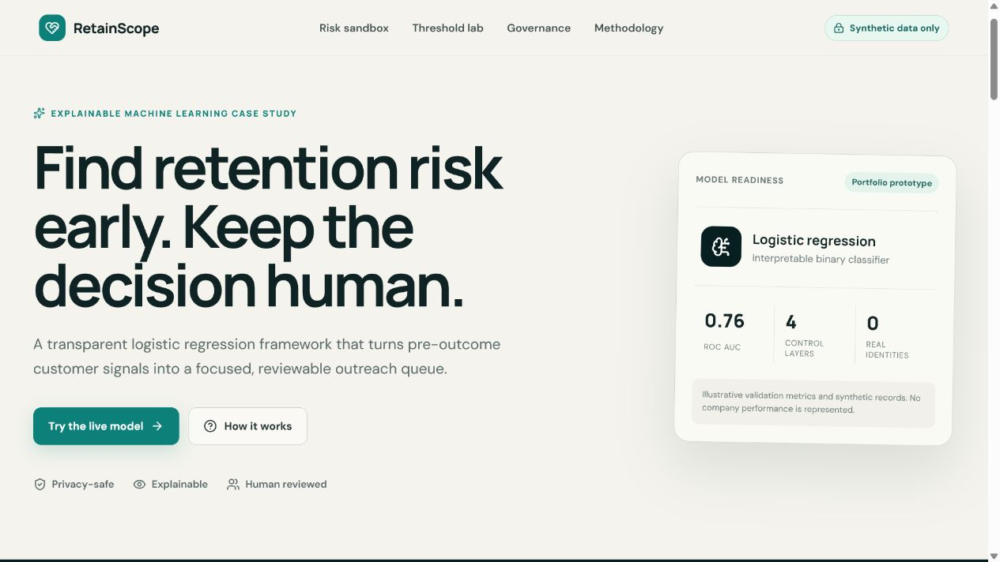

# Customer Retention Risk Lab



An explainable machine learning case study for predicting customer cancellation risk and turning scores into a human-reviewed retention queue.

[Open the live React experience](https://nandini151003.github.io/customer-retention-risk-lab/) · [Read the case study](docs/case-study.md) · [Review the model card](model/MODEL_CARD.md)

## Why this project exists

Retention teams need more than a probability. They need to know why a customer was prioritized, how the threshold affects workload, and what safeguards prevent the model from becoming an automated verdict.

RetainScope demonstrates that full decision path with synthetic data only.

## What you can do

* Adjust contract, tenure, installation, support, payment, and engagement signals
* Watch an explainable risk estimate update instantly in the browser
* Inspect the strongest directional score drivers
* Change the review threshold and see the precision, recall, and queue-size trade-off
* Download a synthetic assessment as JSON
* Review the reproducible Python training pipeline and model card

## Portfolio story

| Layer | Public implementation | Decision supported |
| --- | --- | --- |
| Data | Synthetic customer records | Safe reproduction and testing |
| Model | Logistic regression pipeline | Explainable cancellation probability |
| Operations | Risk bands and threshold planner | Prioritized human review |
| Governance | Leakage, fairness, drift, and calibration checks | Responsible production use |

## Privacy by design

This repository does not contain raw company records, names, emails, phone numbers, internal codes, credentials, or trained artifacts from private data.

The public case-study document has been rebuilt with synthetic examples and scrubbed of creator, revision, and custom metadata. The original machine author identity was removed before publication.

See [the privacy design](docs/privacy.md) and [the public data notes](data/README.md) for the release controls.

## Repository guide

```text
customer-retention-risk-lab/
├── data/                 Synthetic sample data and release notes
├── docs/                 Case study, methodology, privacy notes, source DOCX
├── model/                Training pipeline, requirements, and model card
├── public/assets/        Sanitized portfolio visual
├── scripts/              Automated privacy checks
├── src/                  Interactive React application
└── .github/workflows/    GitHub Pages deployment
```

## Run the React app

```bash
pnpm install
pnpm dev
```

Create a production build:

```bash
pnpm build
```

## Reproduce the model workflow

The training script creates its own synthetic dataset by default, fits a preprocessing and logistic-regression pipeline, and prints an illustrative validation report.

```bash
python -m venv .venv
pip install -r model/requirements.txt
python model/train.py
```

## Responsible-use boundary

This is a portfolio demonstration, not a production decision system. Before deployment, a real implementation would require temporal validation, probability calibration, feature-availability tests, duplicate-account checks, segment-level fairness review, security review, and a controlled retention experiment.

## Author

Built by **Nandini Malik**, Business Analyst and Data Science graduate focused on business analytics, process improvement, and responsible AI.

[LinkedIn](https://www.linkedin.com/in/nandini-malik-384885240) · [GitHub](https://github.com/nandini151003)

## License

Released under the [MIT License](LICENSE).
